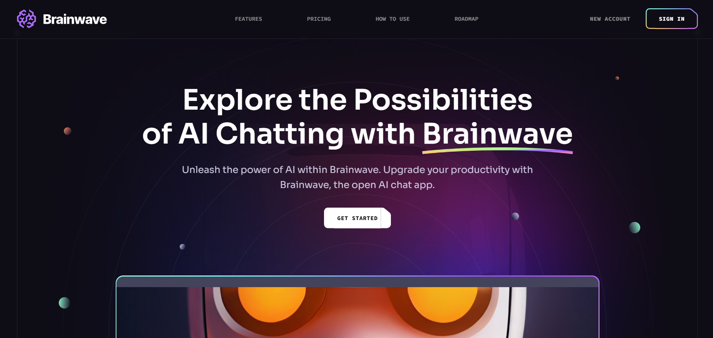
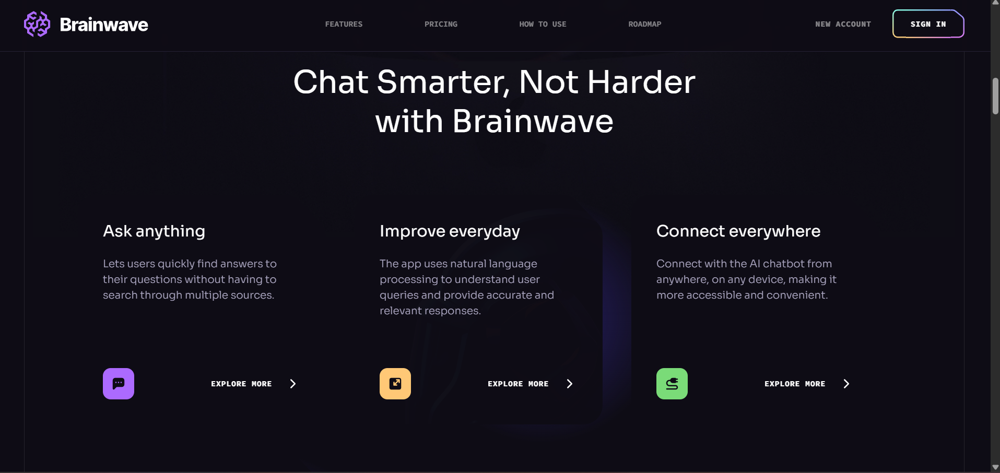
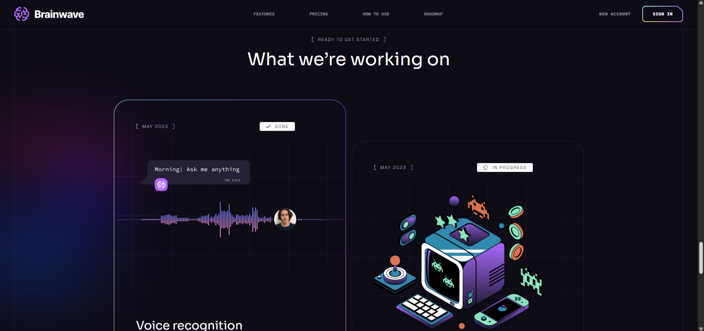

# Brainwave 🧠✨

Brainwave is a modern front-end project built with **React, Vite, Tailwind CSS, and PostCSS**, featuring smooth **parallax effects** and a **bento box layout** for a sleek, dynamic UI. Designed with **mobile-first principles**, it highlights stylish UI components while strengthening **React.js** and **Tailwind CSS** skills.

## 🚀 Features

- **Sleek Parallax Effects** – Smooth scrolling animations for an engaging user experience.
- **Bento Box Layout** – A clean, modern, and responsive grid-based design.
- **Mobile-First Design** – Fully responsive and optimized for all screen sizes.
- **Optimized Performance** – Built with Vite for fast loading and development.
- **Tailwind CSS & PostCSS** – Clean, maintainable, and highly customizable styling.

## 🛠️ Tech Stack

- **React.js** – Component-based UI development.
- **Vite** – Fast bundling and hot module replacement.
- **Tailwind CSS** – Utility-first styling for rapid UI development.
- **PostCSS** – Advanced CSS processing and optimizations.

## 📸 Screenshots

